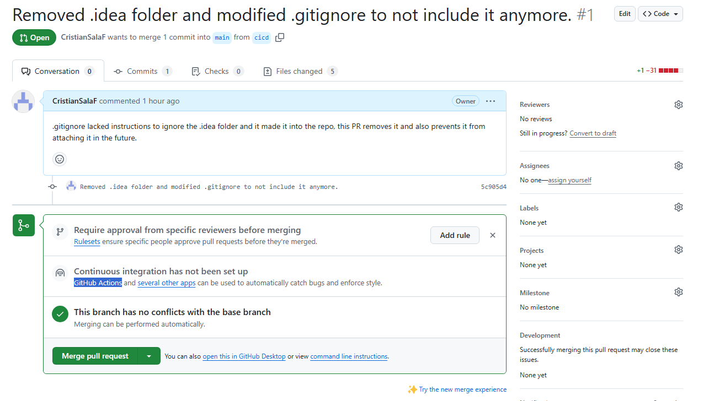

[](https://classroom.github.com/a/vDrr54Dh)

# T2, PR2 - pr2 CristianSalaF
# Nota: no hi haurà videos, ha fallat tot i més en quant a la grabació es refereix.

## Exercici 1
###  Quines són les característiques i els escenaris d'ús de les metodologies àgils de desenvolupament de programari? Explica amb detall i posa un exemple.

#### Característiques principals:
1. Adaptació continua
2. Transparència
3. Comunicació/feedback
4. Col·laboració
5. Eficiència de comunicació
6. Satisfacció del consumidor/client
7. Temps d'entrega curts
8. Mètode sequencial
9. Test freqüent
10. Motivació propia/personal
11. Productes de qualitat
12. Aprenentatge continu
13. Creativitat
14. Pressupost controlat

Permet adaptar el projecte a canvis, i permet que aquest evolucioni per exemple amb el feedback rebut. 
A més a més els clients(o usuaris) poden observar com avanza el projecte, qué s'està desenvolupant, i donar la seva 
opinió ja que permet adaptar el projecte a les noves especificacions requerides conforma aquest avança gracies a eines 
com per exemple les de tipus kanban, entre moltes altres (les quals faciliten la col·laboració, assignació de tasques, 
etcètera, fent també que la comunicació sigui més eficient.

Al proveir aquest "feedback loop", també fà que les tasques i desenvolupament d'aquestes siguin més eficients, 
i escurça el temps necessari per dur-les a terme, especialment des del punt de vista organitzatiu, ja que moltes vegades
un dels grans factors que relentitzen projectes grans es la (manca) de comunicació, o que tingui que passar per diferents 
canals abans d'obtenir una resposta, que tingui que passar per els diferents encarregats i nivells organitzatius, 
fent que per cada decisio hi haguès un periode d'espera abans de que es fessin servir les metodologies àgils.

Això també permet la implementació sequencial de características, i alhora, permet la prova frequënt de les diferentes 
implementacions. Un exemple d'això va ser quan vaig fer la última game Jam, on definir un puzzle que per tu sembla senzill, 
i que tingui una dificultat acceptable, i es pugui completar per qualsevol (realisticament, parlant en quant a temps necessari).
En aquest tipus de projecte sense feedback, acabes amb un joc... injugable, i possiblement injust, ja que tú saps la sol·lució, 
i no pots veure quan trigues a completar-ho, i com evitar que es faci per exemple repetitiu conforme s'avança.

El feeedback loop no només et manté motivat sino que t'ajuda a definir millor les especificacions del projecte, 
i fins i tot proveir idees noves, potenciant la creativitat. D'altra banda, et permet controlar tant el temps disponible 
i les tasques restants, com el pressupost, millorant l'eficiència del projecte.

Si voleu veure de què parlo us convido a visitar [Un-Lit](https://csf91.itch.io/un-lit). 
El projecte es va fer en 7 dies, i el tema de la game jam era "last stand". 
Sense feedback loop hauria sigut literalment impossible. 

Gairebè m'oblido de la part més important: L'aprenentatge continuat: era la primera vegada fent un joc de tipus puzzle, i no paraven de sortir suggerencies de 
coses que no havia fet mai abans, s'aprèn molt d'aquestes, especialment.

#### Escenaris d'us:
- Desenvolupament d'apps siguin web o no, on necessites feedback i testing constant
- Sector de videjocs: implementació secuencial de característiques a més a més del feedback i control de pressupost
- Creació d'APIs, refactoring, i molts altres

## Exercici 2
### Què són els dobles de prova?
Els tipus de dobles de prova son els simulacres i els espies, i es fan servir per escriure proves unitàries que 
permeten injectar dependencies per dur a terme el unit testing.
Els simuladors son un substitut complet de la dependència, i es programen per retornar la sortida especificada sempre 
que es crida al mètode del simulador. 

Exemple de classe:
```cs
[TestMethod]
public void EngineTemperature_Initializes_Value_Returned_By_Engine()
{
    const int engineTemperatureFromEngine = 200;
    Engine engine = new FakeEngine(engineTemperatureFromEngine);
    var car = new Car(engine);

    Assert.AreEqual(engineTemperatureFromEngine, car.EngineTemperature);
}
```
Exemple de mock/dobles de prova:
```cs
[TestMethod]
public void EngineTemperature_Initializes_Value_Returned_By_Engine()
{
    const int engineTemperatureFromEngine = 200;
            
    var engine = Mock.Create();
    engine.Arrange(e => e.TemperatureInFahrenheit).Returns(engineTemperatureFromEngine);

    var car = new Car(engine);

    Assert.AreEqual(engineTemperatureFromEngine, car.EngineTemperature);
}
```

## Exercici 3
### Què és CI/CD?

La integració continua es la pràctica d'integrar canvis automàticament, varies vegades al dia.
La CD té dos possibles significats: la entrega continua (continuous delivery) és quan automatitza les integracions del codi, 
i la implementació continua s'encarrega de fer la build final i distribuir-la.

Passos:
1. Crear o escollir un repositori i escollir un projecte.
2. Crear un pull request de una branca secundària, cap a la main per exemple.
3. Donar click al enllaç amb el suggeriment a sota d'on posa que està llest per a fer el commit i que no hi ha conflictes.
3. Escollir un workflow per provar, compilar, "staging", i distribuir el nostre codi amb ell, entre els disponibles a les accions.
    1. Workflow de desenvolupament
    1. Workflow de anàlisi de qualitat del codi.
    1. Workflow de compilació i distribució.
    1. Workflow de desplegament de "storybook".
4. Fer canvis al codi per fer-ne trigger, ja sigui amb un altre pull request quan s'aprova, o amb un push.


[imatge com a link](img/img1.png), no la vol mostrar.

## Exercici 4
### 4. Aplica els patrons de refacció més habituals en el codi que trobaràs en aquest 
[enllaç](https://github.com/damvdev/programacio-entorns-i-processos/blob/main/tema_2/Activitats/T2.PR2/ExerciseFour.cs).

Codi original:
```csharp
using System;

class Program
{
    static void Main(string[] args)
    {
        // Sol·licita l'entrada de l'usuari per calcular l'àrea d'un rectangle
        Console.WriteLine("Introdueix l'amplada del rectangle:");
        double width = Convert.ToDouble(Console.ReadLine());
        Console.WriteLine("Introdueix l'altura del rectangle:");
        double height = Convert.ToDouble(Console.ReadLine());

        // Calcula l'àrea
        double area = width * height;
        Console.WriteLine("L'àrea del rectangle és: " + area);

        // Sol·licita l'entrada de l'usuari per calcular la circumferència d'un cercle
        Console.WriteLine("Introdueix el radi del cercle:");
        double radius = Convert.ToDouble(Console.ReadLine());
        double circumference = 2 * Math.PI * radius;

        Console.WriteLine("La circumferència del cercle és: " + circumference);

        // Imprimeix un missatge basat en el valor de l'àrea
        if (area > 50)
        {
            Console.WriteLine("L'àrea és més gran de 50");
        }
        else if (area > 20)
        {
            Console.WriteLine("L'àrea és entre 20 i 50");
        }
        else
        {
            Console.WriteLine("L'àrea és menor o igual a 20");
        }
    }
}
```

[Link al codi](Program.cs)

## Exercici 5

No s'ha realitzat, el git té malament la entrega a les 22h, i n'he perdut més de 6h amb la grabació.

## Exercici 6
### Què són els analitzadors de codi? Fes un vídeo explicant les característiques principals i mostra la configuració i funcionament de Sonarqube amb una solució teva en C#.

no s'ha realitzat el video, el git té malament la entrega a les 22h, i he perdut més de 6h amb la grabació.

Es tracta d’un programa que analitza el codi contínuament en segon pla en busca d’errors, 
i per a fer-ho funcionar es necessiten 3 parts que s'han de instalar. 
Primer, instalar SonarQube al sistema. Segon, el SonarScanner que s’ha d’enllaçar amb el SonarQube. 
I per últim, una extensió a Visual Studio que s’anomena SonarLint, i també s’ha d’enllaçar a un projecte de SonarQube 
(si no hi ha un, es crea primer, i el seu ID es la part darrera del “?” de la URL).

Un altre exemple d'això es el que proveeix el IDE Rider, que escaneja activament el codi en segon pla conforme l'edites 
amb la "solution-wide analysis". 

### Fonts

> Exercici 1
> - "14 Agile Characteristics for Project Management Success. Indeed. Recuperat el 03/12/2024 
> de https://www.indeed.com/career-advice/career-development/agile-characteristics.
> 
> Exercici 2
> - Creació de simulacres i espies a Mockito amb exemples de codi. myservername. 
> Recuperat el 27/11/2024 de https://ca.myservername.com/creating-mocks-spies-mockito-with-code-examples
> 
> - Introduction to Unit Testing Part 6: Test Doubles. daedtech, by By Erik Dietrich(31/07/2014). 
> Recuperat el 27/11/2024 de https://daedtech.com/introduction-to-unit-testing-part-6-test-doubles/ 
> 
> Exercici 3
> - ¿Qué es CI/CD? by Unity Technologies. Recuperat el 27/11/2024 de https://unity.com/es/topics/what-is-ci-cd
>
> - How to build a CI/CD pipeline with GitHub Actions in four simple steps. Blog de github. Recuperat el 27/11/2024 
> de https://github.blog/enterprise-software/ci-cd/build-ci-cd-pipeline-github-actions-four-steps/


### ChatGPT / IA
> No se'n ha fet servir cap per aquesta recerca. S'ha cercat manualment.